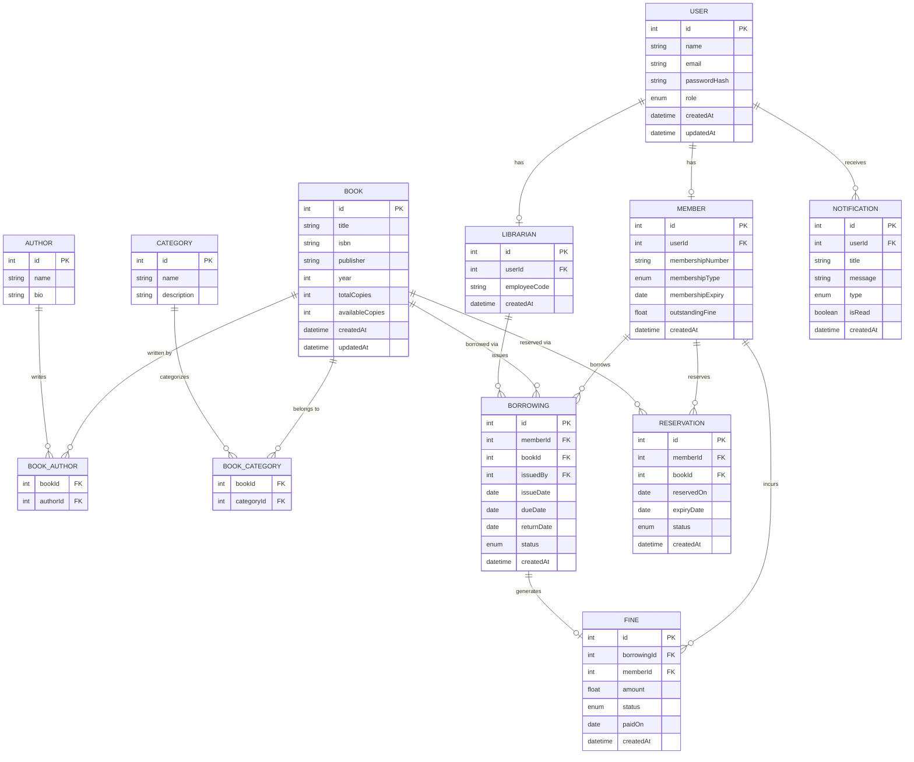

# ER Diagram — Smart Library & Resource Management System (SLRMS)

---

## Entity Descriptions

| Entity | Description |
|---|---|
| `USER` | Base entity for all system users. Role can be `ADMIN`, `LIBRARIAN`, or `MEMBER`. |
| `MEMBER` | A library member who can borrow/reserve books. Linked to USER. |
| `LIBRARIAN` | A staff member who manages borrowings and cataloguing. Linked to USER. |
| `BOOK` | Represents a book in the library with copy tracking. |
| `AUTHOR` | Author details, linked to books via BOOK_AUTHOR. |
| `CATEGORY` | Genre/subject classification for books. |
| `BOOK_AUTHOR` | Junction table — many-to-many between BOOK and AUTHOR. |
| `BOOK_CATEGORY` | Junction table — many-to-many between BOOK and CATEGORY. |
| `BORROWING` | Tracks issued books with status: `ISSUED`, `RETURNED`, `OVERDUE`. |
| `RESERVATION` | Tracks book reservations with status: `PENDING`, `FULFILLED`, `CANCELLED`, `EXPIRED`. |
| `FINE` | Auto-generated when a borrowing becomes overdue. Status: `UNPAID`, `PAID`. |
| `NOTIFICATION` | System notifications for due dates, availability, and overdue alerts. |
