# Class Diagram — Smart Library & Resource Management System (SLRMS)

```mermaid
classDiagram

    %% ─────────────────────────────────────────
    %% Models
    %% ─────────────────────────────────────────

    class User {
        +int id
        +string name
        +string email
        +string passwordHash
        +UserRole role
        +Date createdAt
    }

    class Member {
        +int id
        +int userId
        +string membershipNumber
        +MembershipType membershipType
        +Date membershipExpiry
        +float outstandingFine
    }

    class Librarian {
        +int id
        +int userId
        +string employeeCode
    }

    class Book {
        +int id
        +string title
        +string isbn
        +string publisher
        +int year
        +int totalCopies
        +int availableCopies
    }

    class Author {
        +int id
        +string name
        +string bio
    }

    class Category {
        +int id
        +string name
        +string description
    }

    class Borrowing {
        +int id
        +int memberId
        +int bookId
        +int issuedBy
        +Date issueDate
        +Date dueDate
        +Date returnDate
        +BorrowingStatus status
    }

    class Reservation {
        +int id
        +int memberId
        +int bookId
        +Date reservedOn
        +Date expiryDate
        +ReservationStatus status
    }

    class Fine {
        +int id
        +int borrowingId
        +int memberId
        +float amount
        +FineStatus status
        +Date paidOn
    }

    class Notification {
        +int id
        +int userId
        +string title
        +string message
        +NotificationType type
        +boolean isRead
    }

    %% ─────────────────────────────────────────
    %% Enums
    %% ─────────────────────────────────────────

    class UserRole {
        <<enumeration>>
        ADMIN
        LIBRARIAN
        MEMBER
    }

    class BorrowingStatus {
        <<enumeration>>
        ISSUED
        RETURNED
        OVERDUE
    }

    class ReservationStatus {
        <<enumeration>>
        PENDING
        FULFILLED
        CANCELLED
        EXPIRED
    }

    class FineStatus {
        <<enumeration>>
        UNPAID
        PAID
    }

    class NotificationType {
        <<enumeration>>
        DUE_REMINDER
        OVERDUE_ALERT
        AVAILABILITY
        GENERAL
    }

    %% ─────────────────────────────────────────
    %% Repositories (Data Access Layer)
    %% ─────────────────────────────────────────

    class IUserRepository {
        <<interface>>
        +findById(id: int) User
        +findByEmail(email: string) User
        +create(data: CreateUserDTO) User
        +update(id: int, data: UpdateUserDTO) User
        +delete(id: int) void
    }

    class IBookRepository {
        <<interface>>
        +findById(id: int) Book
        +findAll(filters: BookFilterDTO) Book[]
        +create(data: CreateBookDTO) Book
        +update(id: int, data: UpdateBookDTO) Book
        +delete(id: int) void
        +decrementCopies(id: int) void
        +incrementCopies(id: int) void
    }

    class IBorrowingRepository {
        <<interface>>
        +findById(id: int) Borrowing
        +findByMember(memberId: int) Borrowing[]
        +findOverdue() Borrowing[]
        +create(data: CreateBorrowingDTO) Borrowing
        +update(id: int, data: UpdateBorrowingDTO) Borrowing
    }

    class IFineRepository {
        <<interface>>
        +findByMember(memberId: int) Fine[]
        +findUnpaid(memberId: int) Fine[]
        +create(data: CreateFineDTO) Fine
        +markAsPaid(id: int) Fine
    }

    class UserRepository {
        -prisma: PrismaClient
        +findById(id: int) User
        +findByEmail(email: string) User
        +create(data: CreateUserDTO) User
        +update(id: int, data: UpdateUserDTO) User
        +delete(id: int) void
    }

    class BookRepository {
        -prisma: PrismaClient
        +findById(id: int) Book
        +findAll(filters: BookFilterDTO) Book[]
        +create(data: CreateBookDTO) Book
        +update(id: int, data: UpdateBookDTO) Book
        +delete(id: int) void
        +decrementCopies(id: int) void
        +incrementCopies(id: int) void
    }

    class BorrowingRepository {
        -prisma: PrismaClient
        +findById(id: int) Borrowing
        +findByMember(memberId: int) Borrowing[]
        +findOverdue() Borrowing[]
        +create(data: CreateBorrowingDTO) Borrowing
        +update(id: int, data: UpdateBorrowingDTO) Borrowing
    }

    class FineRepository {
        -prisma: PrismaClient
        +findByMember(memberId: int) Fine[]
        +findUnpaid(memberId: int) Fine[]
        +create(data: CreateFineDTO) Fine
        +markAsPaid(id: int) Fine
    }

    %% ─────────────────────────────────────────
    %% Services (Business Logic Layer)
    %% ─────────────────────────────────────────

    class AuthService {
        -userRepository: IUserRepository
        -jwtSecret: string
        +register(data: RegisterDTO) AuthResponseDTO
        +login(email: string, password: string) AuthResponseDTO
        +verifyToken(token: string) JwtPayload
        -hashPassword(password: string) string
        -comparePassword(plain: string, hash: string) boolean
    }

    class BookService {
        -bookRepository: IBookRepository
        +getAllBooks(filters: BookFilterDTO) Book[]
        +getBookById(id: int) Book
        +addBook(data: CreateBookDTO) Book
        +updateBook(id: int, data: UpdateBookDTO) Book
        +deleteBook(id: int) void
    }

    class BorrowingService {
        -borrowingRepository: IBorrowingRepository
        -bookRepository: IBookRepository
        -fineService: FineService
        -notificationService: NotificationService
        +issueBook(memberId: int, bookId: int, librarianId: int) Borrowing
        +returnBook(borrowingId: int) Borrowing
        +getOverdueBorrowings() Borrowing[]
        +getMemberHistory(memberId: int) Borrowing[]
    }

    class ReservationService {
        -reservationRepository: IReservationRepository
        -bookRepository: IBookRepository
        -notificationService: NotificationService
        +reserveBook(memberId: int, bookId: int) Reservation
        +cancelReservation(reservationId: int) Reservation
        +fulfillReservation(reservationId: int) Reservation
        +expireReservations() void
    }

    class FineService {
        -fineRepository: IFineRepository
        -fineRatePerDay: float
        +calculateFine(dueDate: Date, returnDate: Date) float
        +createFine(borrowingId: int, memberId: int, amount: float) Fine
        +payFine(fineId: int) Fine
        +getMemberFines(memberId: int) Fine[]
    }

    class NotificationService {
        -notificationRepository: INotificationRepository
        +sendDueReminder(userId: int, bookTitle: string, dueDate: Date) void
        +sendOverdueAlert(userId: int, bookTitle: string) void
        +sendAvailabilityAlert(userId: int, bookTitle: string) void
        +getUserNotifications(userId: int) Notification[]
        +markAsRead(notificationId: int) void
    }

    %% ─────────────────────────────────────────
    %% Controllers (Presentation Layer)
    %% ─────────────────────────────────────────

    class AuthController {
        -authService: AuthService
        +register(req: Request, res: Response) void
        +login(req: Request, res: Response) void
    }

    class BookController {
        -bookService: BookService
        +getAllBooks(req: Request, res: Response) void
        +getBook(req: Request, res: Response) void
        +addBook(req: Request, res: Response) void
        +updateBook(req: Request, res: Response) void
        +deleteBook(req: Request, res: Response) void
    }

    class BorrowingController {
        -borrowingService: BorrowingService
        +issueBook(req: Request, res: Response) void
        +returnBook(req: Request, res: Response) void
        +getMemberHistory(req: Request, res: Response) void
        +getOverdue(req: Request, res: Response) void
    }

    class FineController {
        -fineService: FineService
        +getMemberFines(req: Request, res: Response) void
        +payFine(req: Request, res: Response) void
    }

    class NotificationController {
        -notificationService: NotificationService
        +getNotifications(req: Request, res: Response) void
        +markAsRead(req: Request, res: Response) void
    }

    %% ─────────────────────────────────────────
    %% Middleware
    %% ─────────────────────────────────────────

    class AuthMiddleware {
        +authenticate(req: Request, res: Response, next: NextFunction) void
        +authorize(roles: UserRole[]) MiddlewareFunction
    }

    class ErrorMiddleware {
        +handle(err: AppError, req: Request, res: Response, next: NextFunction) void
    }

    class AppError {
        +int statusCode
        +string message
        +boolean isOperational
    }

    %% ─────────────────────────────────────────
    %% Relationships
    %% ─────────────────────────────────────────

    User "1" --> "0..1" Member : has
    User "1" --> "0..1" Librarian : has
    Member "1" --> "0..*" Borrowing : has
    Member "1" --> "0..*" Reservation : has
    Member "1" --> "0..*" Fine : incurs
    Book "1" --> "0..*" Borrowing : involved in
    Book "1" --> "0..*" Reservation : involved in
    Borrowing "1" --> "0..1" Fine : generates
    Book "0..*" --> "0..*" Author : written by
    Book "0..*" --> "0..*" Category : classified under

    IUserRepository <|.. UserRepository : implements
    IBookRepository <|.. BookRepository : implements
    IBorrowingRepository <|.. BorrowingRepository : implements
    IFineRepository <|.. FineRepository : implements

    AuthService --> IUserRepository : uses
    BookService --> IBookRepository : uses
    BorrowingService --> IBorrowingRepository : uses
    BorrowingService --> IBookRepository : uses
    BorrowingService --> FineService : uses
    BorrowingService --> NotificationService : uses
    FineService --> IFineRepository : uses
    ReservationService --> BookService : uses
    ReservationService --> NotificationService : uses

    AuthController --> AuthService : uses
    BookController --> BookService : uses
    BorrowingController --> BorrowingService : uses
    FineController --> FineService : uses
    NotificationController --> NotificationService : uses
```

---

## Layer Summary

| Layer | Classes | Responsibility |
|---|---|---|
| **Models** | User, Book, Borrowing, Reservation, Fine, Notification | Data shape and domain entities |
| **Repository** | UserRepository, BookRepository, BorrowingRepository, FineRepository | Database access via Prisma |
| **Service** | AuthService, BookService, BorrowingService, FineService, NotificationService | Business logic |
| **Controller** | AuthController, BookController, BorrowingController, FineController | HTTP request handling |
| **Middleware** | AuthMiddleware, ErrorMiddleware | Cross-cutting concerns |
