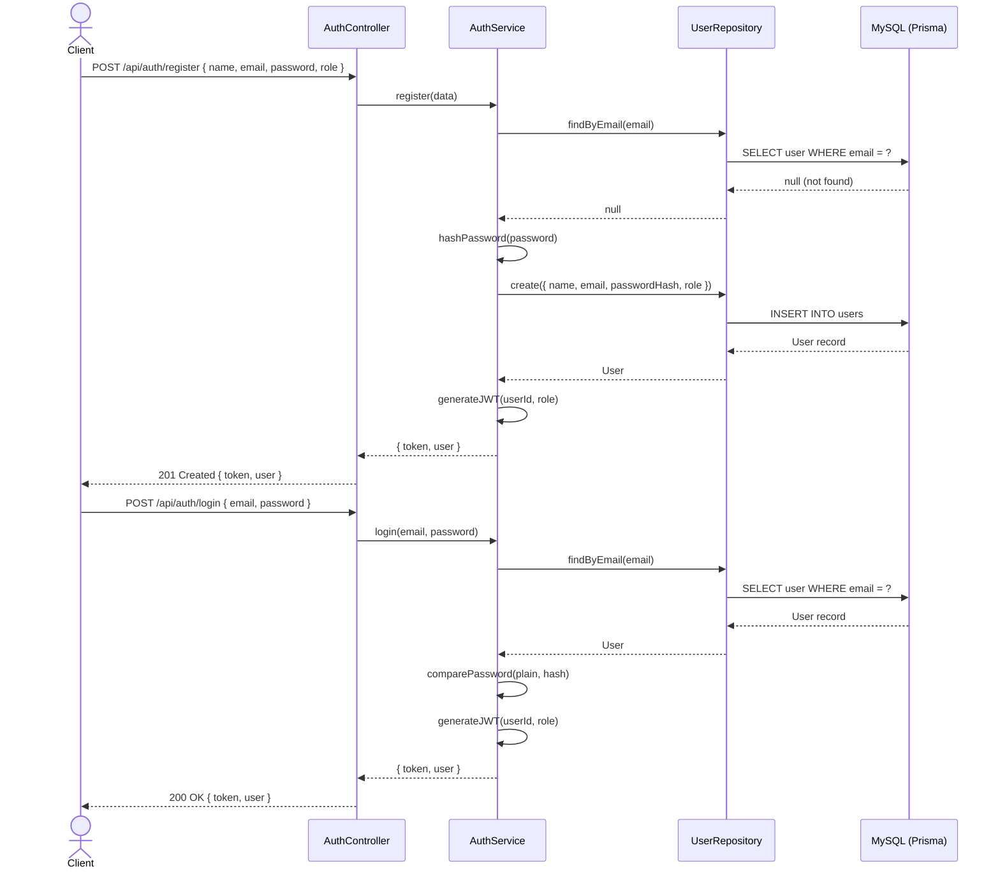
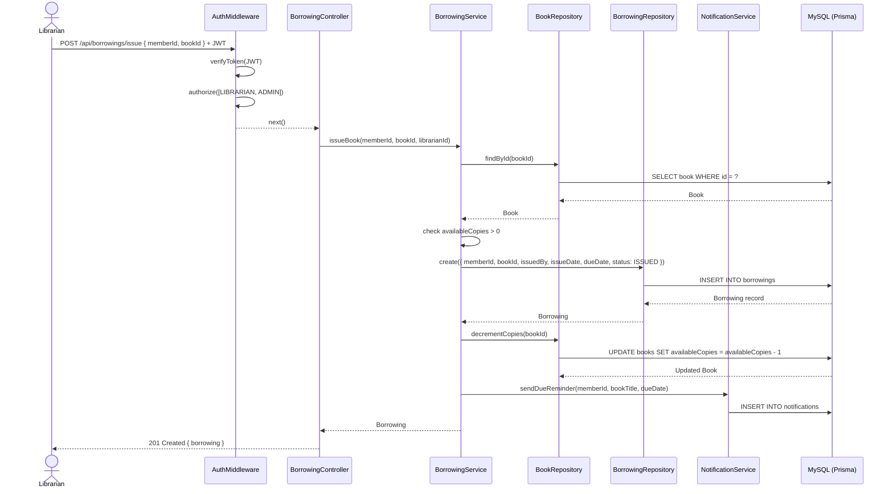
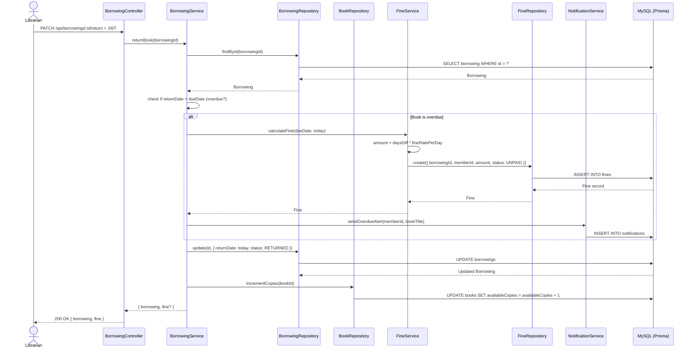
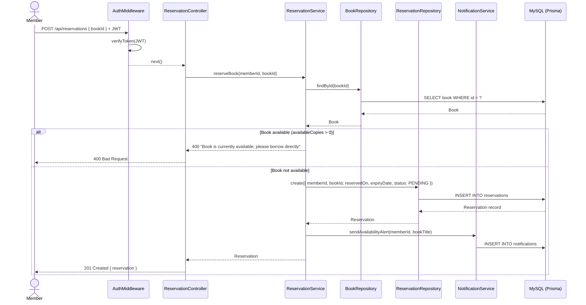
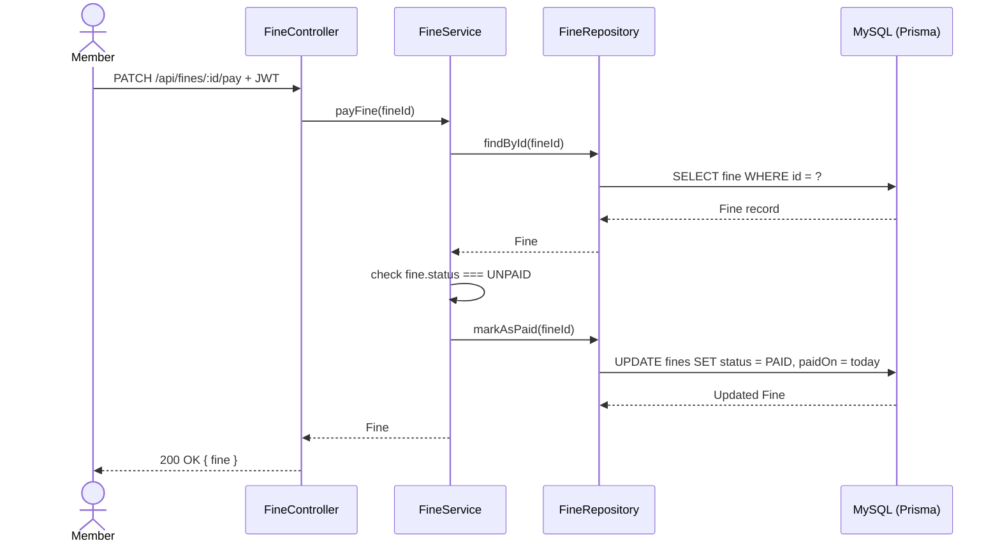

# Sequence Diagrams — Smart Library & Resource Management System (SLRMS)

---

## 1. User Registration & Login

---

## 2. Issue a Book (Librarian Issues Book to Member)

---

## 3. Return a Book & Fine Calculation

---

## 4. Reserve a Book (Member)

---

## 5. Pay a Fine (Member)

