# Use Case Diagram — Smart Library & Resource Management System (SLRMS)

```mermaid
graph TB
    %% ─── Actors ───
    Admin(["👤 Admin"])
    Librarian(["👤 Librarian"])
    Member(["👤 Member"])
    System(["⚙️ System (Scheduled Jobs)"])

    %% ─── System Boundary ───
    subgraph SLRMS ["Smart Library & Resource Management System"]

        subgraph Auth ["Authentication"]
            UC1["Register Account"]
            UC2["Login"]
            UC3["Logout"]
        end

        subgraph UserMgmt ["User Management"]
            UC4["View All Users"]
            UC5["Update User Role"]
            UC6["Deactivate User"]
        end

        subgraph BookMgmt ["Book & Catalogue Management"]
            UC7["Add Book"]
            UC8["Update Book Details"]
            UC9["Delete Book"]
            UC10["Search / Browse Books"]
            UC11["View Book Details"]
            UC12["Manage Authors & Categories"]
        end

        subgraph BorrowMgmt ["Borrowing Management"]
            UC13["Issue Book to Member"]
            UC14["Return Book"]
            UC15["View Active Borrowings"]
            UC16["View Borrowing History"]
        end

        subgraph ReservationMgmt ["Reservation Management"]
            UC17["Reserve a Book"]
            UC18["Cancel Reservation"]
            UC19["View My Reservations"]
            UC20["Fulfill Reservation"]
        end

        subgraph FineMgmt ["Fine Management"]
            UC21["View My Fines"]
            UC22["Pay Fine"]
            UC23["View All Fines (Admin)"]
            UC24["Auto-Generate Fine"]
        end

        subgraph NotifMgmt ["Notification Management"]
            UC25["Send Due Date Reminder"]
            UC26["Send Overdue Alert"]
            UC27["Send Availability Alert"]
            UC28["View Notifications"]
            UC29["Mark Notification as Read"]
        end

    end

    %% ─── Admin Associations ───
    Admin --- UC1
    Admin --- UC2
    Admin --- UC3
    Admin --- UC4
    Admin --- UC5
    Admin --- UC6
    Admin --- UC7
    Admin --- UC8
    Admin --- UC9
    Admin --- UC10
    Admin --- UC11
    Admin --- UC12
    Admin --- UC15
    Admin --- UC23

    %% ─── Librarian Associations ───
    Librarian --- UC1
    Librarian --- UC2
    Librarian --- UC3
    Librarian --- UC7
    Librarian --- UC8
    Librarian --- UC10
    Librarian --- UC11
    Librarian --- UC12
    Librarian --- UC13
    Librarian --- UC14
    Librarian --- UC15
    Librarian --- UC16
    Librarian --- UC20

    %% ─── Member Associations ───
    Member --- UC1
    Member --- UC2
    Member --- UC3
    Member --- UC10
    Member --- UC11
    Member --- UC16
    Member --- UC17
    Member --- UC18
    Member --- UC19
    Member --- UC21
    Member --- UC22
    Member --- UC28
    Member --- UC29

    %% ─── System Associations ───
    System --- UC24
    System --- UC25
    System --- UC26
    System --- UC27

    %% ─── Styling ───
    style Auth fill:#dbeafe,stroke:#3b82f6
    style UserMgmt fill:#ede9fe,stroke:#7c3aed
    style BookMgmt fill:#dcfce7,stroke:#16a34a
    style BorrowMgmt fill:#fef9c3,stroke:#ca8a04
    style ReservationMgmt fill:#ffedd5,stroke:#ea580c
    style FineMgmt fill:#fee2e2,stroke:#dc2626
    style NotifMgmt fill:#f0fdf4,stroke:#22c55e
```

---

## Use Case Descriptions

### Authentication
| Use Case | Actors | Description |
|---|---|---|
| Register Account | Admin, Librarian, Member | Create a new account with name, email, password, and role |
| Login | All | Authenticate and receive a JWT token |
| Logout | All | Invalidate session/token on client |

### User Management (Admin only)
| Use Case | Actors | Description |
|---|---|---|
| View All Users | Admin | List all registered users with roles and status |
| Update User Role | Admin | Promote/demote a user's role |
| Deactivate User | Admin | Disable a user account |

### Book & Catalogue Management
| Use Case | Actors | Description |
|---|---|---|
| Add Book | Admin, Librarian | Add a new book with title, ISBN, author, category, and copies |
| Update Book Details | Admin, Librarian | Edit book metadata or copy count |
| Delete Book | Admin | Remove a book from the catalogue |
| Search / Browse Books | All | Search by title, author, category, or ISBN |
| View Book Details | All | View full details of a book including availability |
| Manage Authors & Categories | Admin, Librarian | CRUD operations on authors and categories |

### Borrowing Management
| Use Case | Actors | Description |
|---|---|---|
| Issue Book to Member | Librarian, Admin | Issue an available book to a member with a due date |
| Return Book | Librarian, Admin | Process a book return and trigger fine if overdue |
| View Active Borrowings | Librarian, Admin | See all currently issued books |
| View Borrowing History | Librarian, Admin, Member | See complete borrowing history for self or all members |

### Reservation Management
| Use Case | Actors | Description |
|---|---|---|
| Reserve a Book | Member | Reserve an unavailable book for when it becomes available |
| Cancel Reservation | Member | Cancel an existing pending reservation |
| View My Reservations | Member | See all pending and past reservations |
| Fulfill Reservation | Librarian | Convert a reservation to a borrowing when book is available |

### Fine Management
| Use Case | Actors | Description |
|---|---|---|
| View My Fines | Member | See all outstanding and paid fines |
| Pay Fine | Member | Mark a fine as paid |
| View All Fines | Admin | See all fines across all members |
| Auto-Generate Fine | System | Automatically generate a fine when a borrowing becomes overdue |

### Notification Management
| Use Case | Actors | Description |
|---|---|---|
| Send Due Date Reminder | System | Notify member 2 days before due date |
| Send Overdue Alert | System | Notify member when a book becomes overdue |
| Send Availability Alert | System | Notify member when a reserved book becomes available |
| View Notifications | Member | See all system notifications |
| Mark Notification as Read | Member | Mark individual or all notifications as read |
